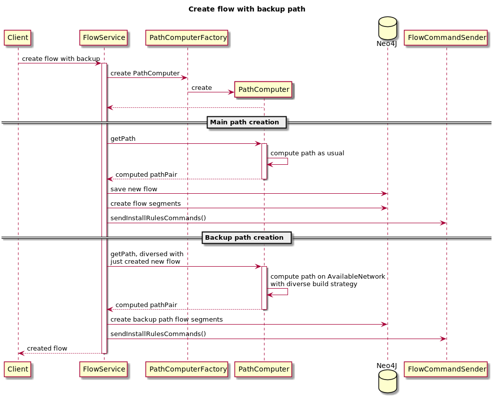

# Backup path for flow

## Goals
Calculate and deploy reserved diverse path for flow, so if the main path will fail we can switch traffic fast to reserved.

## NB contract changes
Request: add optional isBackup Flow boolean property. Optional, default is false.

## DB changes
Add isBackup property to Flow and FlowSegment relations.
Reserved path will store as FlowSegments in Neo4J as usual, except property isBackup=true set.

### Sequence Diagram

### Limitations
We still needed control plane to perform switching to reserved path, with several controller roundtrips.
