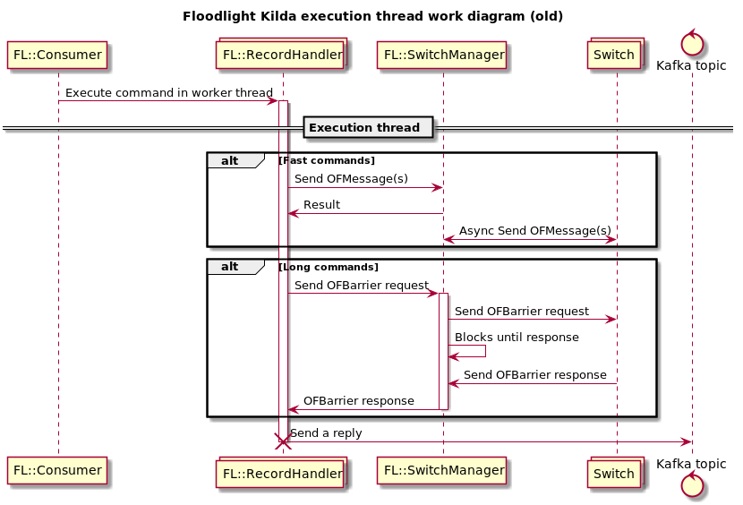
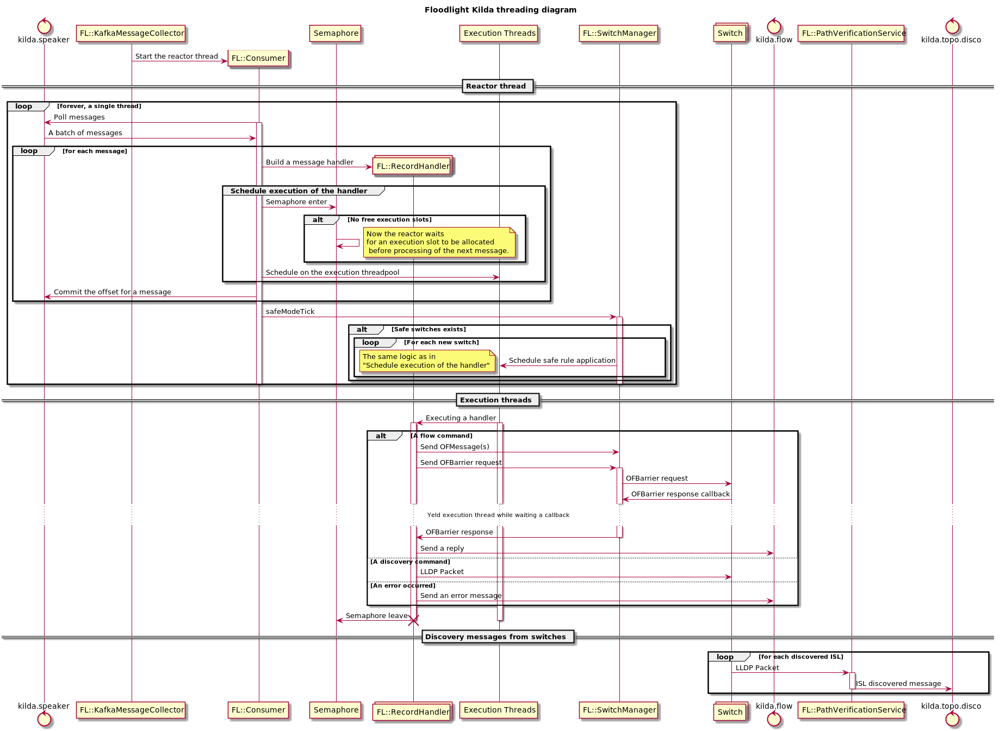

# Floodlight: nonblocking wait of long net calls

## Problem
Sometimes Floodlight needs to make synchronous net calls to switches (eg. dumpFlowTable(), sendBarrierRequest()) during command processing. Currently this interaction blocks the execution thread.

The execution thread currently is not able to process other commands while it waiting network IO. It leads to not efficient resource management: needs more physical threads to prevent system stuck on network waiting.

## Solution overview
Floodlight core api returns Future on initiating long net operation. In current implementation executing thread blocks on getting the Future result. 
Instead that, all methods that call this operations should also become async and return Future to. All handlers should executes on single ThreadPool with queue, including Future callbacks. 
To limit number of commands in system uses semaphore counter.

## Implementation overview
This approach can be implemented with standard Java features like CompletableFuture, or with some highlevel reactive library (eg. https://projectreactor.io/)

### Sequence Diagrams

#### Current implementation 

#### Current implementation (Execution thread part)

#### New implementation
